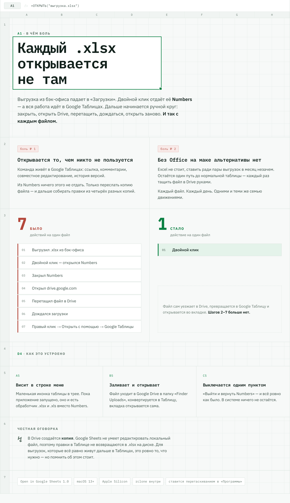

# Open in Google Sheets

Приложение в строке меню для macOS. Пока оно запущено, двойной клик по `.xlsx` и `.xls`
заливает файл в Google Drive, конвертирует в Google Таблицу и открывает её в браузере.
Вышел из приложения — эти файлы снова открываются в Numbers.

<picture>
  <source media="(prefers-color-scheme: dark)" srcset="docs/infographic-dark.png">
  
</picture>

---

## Зачем

Выгрузка из бэк-офиса падает в «Загрузки», двойной клик отдаёт её Numbers — а работа идёт
в Google Таблицах. Ссылку из Numbers не дать, совместно не поработать, а если Excel не
установлен, то альтернативы нет вообще: остаётся каждый раз вручную тащить файл в Drive.

Это приложение убирает шаги со второго по седьмой.

**Требования:** macOS 13+, Apple Silicon.

---

## Установка

1. Скачать `Open in Google Sheets.zip` из [Releases](../../releases) и распаковать.
2. **Перетащить приложение в «Программы».** Это обязательно: macOS не разрешает назначать
   обработчиком файлов приложение, лежащее в «Загрузках» или во временной папке. Если запустить
   оттуда, приложение само предложит себя переместить.
3. Первый запуск — **правый клик по иконке → «Открыть»**. Обычный двойной клик macOS
   заблокирует: приложение подписано ad-hoc, а не сертификатом Apple Developer.
4. При первом запуске приложение спросит, добавить ли себя в автозапуск.
5. В меню в трее выбрать **«Подключить Google Drive…»** — откроется браузер, нужно выбрать
   аккаунт и разрешить доступ. Делается один раз.

Если Gatekeeper всё же говорит «повреждено», снять карантин:

```bash
xattr -dr com.apple.quarantine "/Applications/Open in Google Sheets.app"
```

---

## Меню

| Пункт | Что делает |
|---|---|
| Строка статуса | «Активно» / «Google Drive не подключён» / «Загружаю…» |
| Открыть папку «Finder Uploads» в Drive | Куда складываются загруженные файлы |
| Подключить / Переподключить Google Drive | OAuth-авторизация rclone |
| Запускать при входе в систему | Галка автозапуска |
| Выйти и вернуть Numbers | Выход + возврат обработчика `.xlsx` / `.xls` |

Во время загрузки иконка в трее блёкнет.

---

## Что важно понимать

- **В Drive создаётся копия.** Google Sheets не умеет редактировать локальный файл, поэтому
  правки в Таблице не попадают обратно в `.xlsx` на диске.
- **Каждое открытие — новая копия** в подпапке с таймстампом внутри `Finder Uploads`.
  Папка растёт, раз в пару месяцев стоит чистить.
- **Работает только пока приложение запущено.** Это и было задумано.
- Если убить приложение через Force Quit, обработчик останется на нём. Не страшно: следующий
  двойной клик по `.xlsx` просто запустит его снова.
- Откатить вручную: Finder → <kbd>Cmd</kbd>+<kbd>I</kbd> на любом `.xlsx` → «Открыть
  в программе» → Numbers → «Настроить все».

**Лог:** `~/Library/Logs/OpenInSheets.log` — запуск, выход и каждая загрузка.

---

## Как устроено

```
Open in Google Sheets.app/
  Contents/MacOS/OpenInSheets     Swift + AppKit, LSUIElement (без иконки в доке)
  Contents/Resources/rclone       rclone (arm64), вшит — ставить отдельно не надо
  Contents/Resources/AppIcon.icns
```

Обработчик типа файла переключается через `LSSetDefaultRoleHandlerForContentType`: при запуске
приложение запоминает текущего владельца `.xlsx` / `.xls` и ставит себя, при выходе возвращает
запомненного (по умолчанию Numbers).

Конфиг Google Drive — обычный rclone-конфиг в `~/.config/rclone/rclone.conf`, remote называется
`gdrive`. Загрузка: `rclone copy <файл> gdrive:"Finder Uploads"/<timestamp>/
--drive-import-formats xlsx,xls`, затем `rclone lsjson` за ID файла и переход на
`docs.google.com/spreadsheets/d/<id>/edit`.

### Две неочевидные вещи

**LaunchServices игнорирует приложения вне «Программ».** Попытка назначить обработчиком
приложение из `/private/tmp` или «Загрузок» проходит без ошибки, но ничего не меняет. Отсюда
проверка расположения при запуске — иначе приложение молча не работает.

**AppleScript не находит его по имени.** `tell application "OpenInSheets" to quit` игнорируется,
работает только `tell application id "io.github.bsyrovatkin.OpenInSheets" to quit`.

---

## Сборка из исходников

```bash
./src/build.sh
```

Нужны Xcode Command Line Tools (`swiftc`) и rclone в `~/bin/rclone`. Скрипт компилирует, собирает
бандл, подписывает ad-hoc и регистрирует в LaunchServices. Иконки перегенерируются отдельно:

```bash
python3 src/makeicons.py && iconutil -c icns build/AppIcon.iconset -o build/AppIcon.icns
```

Сборка идёт во временную папку, а не в `Documents`: на директориях под управлением file provider
(iCloud, Dropbox) macOS вешает `com.apple.FinderInfo`, и `codesign` из-за этого падает
с «resource fork, Finder information, or similar detritus not allowed».

---

Личный инструмент, не связан с Apple и Google. Подписан ad-hoc, без нотаризации.
